# Elastic Stack — Observabilidade Modular com Docker Compose

Stack completa e **modular** do Elastic Stack para *homelab* e produção
pequena. O núcleo (Elasticsearch + Kibana) funciona sozinho e os componentes
opcionais são habilitados sob demanda com `-f compose.<módulo>.yaml`.

O shipper **padrão é o Elastic Agent gerenciado por Fleet**. Os Beats clássicos
(Filebeat, Metricbeat, Auditbeat, Heartbeat) existem apenas como módulos
*legacy* de fallback.

---

## Sumário

- [Elastic Stack — Observabilidade Modular com Docker Compose](#elastic-stack--observabilidade-modular-com-docker-compose)
  - [Sumário](#sumário)
  - [Arquitetura](#arquitetura)
  - [Estrutura de diretórios](#estrutura-de-diretórios)
  - [Pré-requisitos](#pré-requisitos)
  - [Início rápido](#início-rápido)
  - [Módulos disponíveis](#módulos-disponíveis)
  - [Exemplos de execução](#exemplos-de-execução)
  - [Explicação de cada módulo](#explicação-de-cada-módulo)
    - [Core — `compose.yaml`](#core--composeyaml)
    - [Elastic Agent — `compose.agent.yaml` (padrão)](#elastic-agent--composeagentyaml-padrão)
    - [Logstash — `compose.logstash.yaml`](#logstash--composelogstashyaml)
    - [APM — `compose.apm.yaml`](#apm--composeapmyaml)
    - [Legacy — Beats](#legacy--beats)
  - [Aplicações de demonstração](#aplicações-de-demonstração)
  - [Segurança](#segurança)
  - [Fleet \& Elastic Agent](#fleet--elastic-agent)
  - [Persistência de dados](#persistência-de-dados)
  - [Variáveis de ambiente](#variáveis-de-ambiente)
  - [Troubleshooting](#troubleshooting)
  - [Expansão futura](#expansão-futura)
  - [Capturas de tela](#capturas-de-tela)

---

## Arquitetura

```
                         ┌──────────────────────────────────────────┐
                         │                CORE (sempre)             │
                         │                                          │
   navegador  ─────────▶ │   Kibana  ◀──────▶  Elasticsearch        │
   :5601                 │   (Fleet-ready)      (single-node, auth) │
                         │        ▲                  ▲              │
                         └────────┼──────────────────┼──────────────┘
                                  │ rede: elastic     │
        ┌─────────────────────────┼───────────────────┼───────────────────────┐
        │ MÓDULOS OPCIONAIS        │                   │                       │
        │                         │                   │                       │
        │  compose.agent.yaml ─▶ Fleet Server ──▶ Elastic Agent (System/Docker)│
        │  compose.logstash.yaml ─▶ Logstash ───────────────┘                  │
        │  compose.apm.yaml ─────▶ APM Server                                   │
        │  compose.{filebeat,metricbeat,auditbeat,heartbeat}.yaml ─▶ Beats      │
        └──────────────────────────────────────────────────────────────────────┘
```

Todos os componentes compartilham a rede bridge dedicada `elastic` e resolvem
uns aos outros pelo **nome do serviço** (`elasticsearch`, `kibana`,
`fleet-server`, ...).

---

## Estrutura de diretórios

```
elasticstack/
├── compose.yaml                 # CORE: Elasticsearch + Kibana + setup
├── compose.agent.yaml           # Elastic Agent + Fleet Server  (padrão)
├── compose.logstash.yaml        # Logstash
├── compose.apm.yaml             # APM Server
├── compose.filebeat.yaml        # legacy
├── compose.metricbeat.yaml      # legacy
├── compose.auditbeat.yaml       # legacy
├── compose.heartbeat.yaml       # legacy
├── compose.demo.yaml            # app de demo: Python/Flask (workload de teste do APM)
├── compose.railsdemo.yaml       # app de demo: Ruby on Rails + PostgreSQL
├── sample.env                   # modelo de variáveis (copie para .env)
├── Makefile                     # atalhos: make up / down / logs ...
├── .gitignore
├── README.md
├── configs/
│   ├── kibana/kibana.yml         # config + pré-configuração de Fleet
│   ├── agent/                    # README + exemplo standalone
│   ├── apm/apm-server.yml
│   ├── logstash/
│   │   ├── config/logstash.yml
│   │   └── pipeline/logstash.conf
│   ├── filebeat/filebeat.yml
│   ├── metricbeat/metricbeat.yml
│   ├── auditbeat/auditbeat.yml
│   └── heartbeat/heartbeat.yml
├── demo/                        # código da app de demo Python/Flask
├── rails-demo/                  # código da app de demo Ruby on Rails (+ PostgreSQL)
└── volumes/                      # bind mounts OPCIONAIS (named volumes por padrão)
    ├── elasticsearch/
    ├── kibana/
    └── logstash/
```

---

## Pré-requisitos

- Docker Engine 24+ e o plugin **Docker Compose v2** (`docker compose`, sem hífen).
- **`vm.max_map_count` ≥ 262144** no host (exigência do Elasticsearch):

  ```bash
  # imediato (até reiniciar)
  sudo sysctl -w vm.max_map_count=262144

  # persistente
  echo 'vm.max_map_count=262144' | sudo tee /etc/sysctl.d/99-elasticsearch.conf
  sudo sysctl --system
  ```

- Memória livre suficiente para os limites definidos no `.env` (o core pede
  ~3 GB com os valores padrão).

---

## Início rápido

```bash
# 1. Crie seu .env a partir do modelo
cp sample.env .env

# 2. EDITE o .env — no mínimo:
#    ELASTIC_PASSWORD, KIBANA_PASSWORD e KIBANA_ENCRYPTION_KEY
#    (gere a chave com: openssl rand -hex 32)

# 3. Suba apenas o core
docker compose up -d

# 4. Acompanhe a saúde dos serviços
docker compose ps

# 5. Acesse o Kibana
#    http://localhost:5601   —   usuário: elastic   senha: $ELASTIC_PASSWORD
```

Ou, usando o Makefile:

```bash
make up                          # core
make MODULES="agent" up          # core + Elastic Agent
make ps
make logs
```

---

## Módulos disponíveis

| Arquivo                     | Serviço(s)                  | Padrão? | Para quê                                   |
|-----------------------------|-----------------------------|:------:|--------------------------------------------|
| `compose.yaml`              | elasticsearch, kibana, setup | core   | Núcleo obrigatório, funciona sozinho       |
| `compose.agent.yaml`        | fleet-server, elastic-agent | ✅ sim | Coleta de logs/métricas/Docker via Fleet   |
| `compose.logstash.yaml`     | logstash                    | —      | Pipeline de ingestão/transformação         |
| `compose.apm.yaml`          | apm-server                  | —      | APM / tracing de aplicações                |
| `compose.filebeat.yaml`     | filebeat                    | legacy | Logs de containers (fallback)              |
| `compose.metricbeat.yaml`   | metricbeat                  | legacy | Métricas de host/Docker (fallback)         |
| `compose.auditbeat.yaml`    | auditbeat                   | legacy | Auditoria/FIM do host (fallback)           |
| `compose.heartbeat.yaml`    | heartbeat                   | legacy | Uptime/synthetics (fallback)               |
| `compose.demo.yaml`         | error-simulator (Python)    | demo   | Workload de teste do APM: traces/logs/métricas |
| `compose.railsdemo.yaml`    | rails-* (Rails + Postgres)  | demo   | Workload de teste do APM + dependência PostgreSQL |

---

## Exemplos de execução

> Dica: use sempre o **mesmo conjunto de `-f`** para `up`, `down`, `logs` etc.
> O `Makefile` cuida disso via `MODULES="..."`.

**Somente o core**
```bash
docker compose up -d
```

**Core + Elastic Agent (recomendado)**
```bash
docker compose -f compose.yaml -f compose.agent.yaml up -d
```

**Core + Logstash**
```bash
docker compose -f compose.yaml -f compose.logstash.yaml up -d
```

**Core + APM**
```bash
docker compose -f compose.yaml -f compose.apm.yaml up -d
```

**Core + módulos legacy (ex.: Filebeat + Metricbeat)**
```bash
docker compose \
  -f compose.yaml \
  -f compose.filebeat.yaml \
  -f compose.metricbeat.yaml \
  up -d
```

**Stack completa (Agent + Logstash + APM)**
```bash
docker compose \
  -f compose.yaml \
  -f compose.agent.yaml \
  -f compose.logstash.yaml \
  -f compose.apm.yaml \
  up -d
```

**APM + Agent + apps de demo (workloads de teste em Python e Rails)**
```bash
make MODULES="apm agent demo railsdemo" up
```

**Encerrar** (mantendo os dados):
```bash
docker compose -f compose.yaml -f compose.agent.yaml down
```

**Encerrar e apagar os volumes de dados**:
```bash
docker compose -f compose.yaml -f compose.agent.yaml down -v
```

---

## Explicação de cada módulo

### Core — `compose.yaml`
- **setup**: container efêmero. Espera o Elasticsearch ficar *healthy* e define a
  senha do usuário `kibana_system` (princípio do menor privilégio). Sai com 0.
- **elasticsearch**: cluster single-node, `xpack.security` habilitado sobre HTTP,
  `memlock`, `ulimits`, heap controlada por `ES_JAVA_HEAP`, dados em volume
  nomeado, healthcheck no `_cluster/health`.
- **kibana**: UI + plano de controle do Fleet. Conecta como `kibana_system` e é
  **pré-configurado** ([`configs/kibana/kibana.yml`](configs/kibana/kibana.yml))
  com as políticas de Fleet, output e Fleet Server hosts — o stack já nasce
  pronto para o Agent enrolar.

### Elastic Agent — `compose.agent.yaml` (padrão)
- **fleet-server**: Elastic Agent em modo Fleet Server. Gera o próprio *service
  token* a partir do usuário `elastic` (sem token manual) e usa a política
  `fleet-server-policy`.
- **elastic-agent**: Agent gerenciado que se auto-enrola na política
  `Elastic Agent Observability` (integrações **System** + **Docker** já
  incluídas). Monta `docker.sock` e `/hostfs` para enxergar host e containers.

### Logstash — `compose.logstash.yaml`
Pipeline com inputs **Beats (5044)** e **TCP/JSON (5000)**, saída para índices
`logs-*`. Pipeline e settings vêm de [`configs/logstash/`](configs/logstash/)
(bind mount) — edite e reinicie o container, sem rebuild.

### APM — `compose.apm.yaml`
APM Server standalone na porta **8200**. Aplicações enviam traces usando o
`APM_SECRET_TOKEN`. Config em [`configs/apm/apm-server.yml`](configs/apm/apm-server.yml).
*(Alternativa: usar a integração APM dentro de uma política do Fleet.)*

### Legacy — Beats
Cada Beat é **independente**, usa a **mesma rede** do core, aponta para o
**Elasticsearch do core** e lê variáveis do `.env`. Use apenas se você ainda
padroniza em Beats; caso contrário, prefira o Elastic Agent.
- **filebeat**: autodiscover de logs de containers Docker.
- **metricbeat**: módulos `system` (via `/hostfs`) + `docker`.
- **auditbeat**: `file_integrity` + `auditd` (veja a ressalva de conflito com o
  `auditd` do host no arquivo de config).
- **heartbeat**: monitores HTTP/TCP/ICMP (já monitora ES e Kibana por padrão).

---

## Aplicações de demonstração

Duas aplicações de exemplo, prontas para rodar, geram **traces, logs, métricas e
dependências** — para você exercitar o APM e a correlação de dados de ponta a
ponta. Ambas enviam traces ao **APM Server** e imprimem **logs ECS-JSON**
correlacionados por `trace.id` no stdout para o **Elastic Agent** coletar — por
isso precisam dos módulos `apm` e `agent` no ar.

| Módulo                   | App                        | Porta | Destaques                                                   |
|--------------------------|----------------------------|:-----:|-------------------------------------------------------------|
| `compose.demo.yaml`      | Python / Flask             | 8000  | Erros aleatórios, tráfego próprio; traces + erros + métricas |
| `compose.railsdemo.yaml` | Ruby on Rails + PostgreSQL | 3000  | Grava no Postgres → **dependência PostgreSQL** no APM       |

- **`demo`** ([demo/](demo/)) — uma "loja" Flask que levanta exceções
  aleatórias e gera o próprio tráfego. Serviço **`python-error-simulator`**.
- **`railsdemo`** ([rails-demo/](rails-demo/)) — uma API Rails que grava
  "orders" no PostgreSQL e falha de propósito, com um sidecar `curl` gerador de
  carga. Serviço **`ruby-rails-error-simulator`**; as queries `pg` fazem o
  **postgresql** aparecer em **APM → Dependencies** e no **Service Map**.

**Suba as duas, junto com APM + Agent:**

```bash
make MODULES="apm agent demo railsdemo" up

# comando cru equivalente (a primeira subida compila as imagens):
docker compose -f compose.yaml -f compose.apm.yaml -f compose.agent.yaml \
               -f compose.demo.yaml -f compose.railsdemo.yaml up -d --build
```

**Onde olhar no Kibana** (http://localhost:5601 → **APM**):

- **Services** → `python-error-simulator` e `ruby-rails-error-simulator`.
- **Errors** → as exceções aleatórias, agrupadas por tipo.
- **Dependencies** → **postgresql** (da app Rails).
- **Service Map** → os dois serviços, com a aresta Rails → postgresql.
- Abra um trace → o waterfall de spans, os **Errors** relacionados e a aba
  **Logs** (linhas com o mesmo `trace.id`).

> A **correlação log ↔ trace** exige que o coletor faça o parse do JSON do
> stdout em campos. O Filebeat já honra os labels `co.elastic.logs/json.*` do
> container; para a integração Docker do Elastic Agent há um ajuste único —
> veja [demo/README.md](demo/README.md#making-log--trace-correlation-work).

Cada app tem seu próprio README com endpoints e ajustes:
[demo/README.md](demo/README.md) · [rails-demo/README.md](rails-demo/README.md).

---

## Segurança

- `xpack.security` **habilitado**: toda chamada exige autenticação.
- Usuário admin: **`elastic`** / `ELASTIC_PASSWORD`.
- Kibana usa **`kibana_system`** (menor privilégio), configurado pelo `setup`.
- **TLS desabilitado por padrão** (HTTP) para simplificar o homelab. Os serviços
  trafegam dentro da rede Docker isolada `elastic`.

> ⚠️ **Antes de expor à rede/Internet**, troque todas as senhas, defina um
> `KIBANA_ENCRYPTION_KEY` aleatório e **habilite TLS**:
> gere certificados (ex.: `elasticsearch-certutil`), monte-os, e troque
> `xpack.security.http.ssl.enabled` para `true` no Elasticsearch e os endpoints
> `http://` por `https://` no Kibana/Agent/Beats.

---

## Fleet & Elastic Agent

A pré-configuração em [`configs/kibana/kibana.yml`](configs/kibana/kibana.yml)
cria automaticamente:

- **Fleet Server Policy** (`fleet-server-policy`) — usada pelo `fleet-server`.
- **Elastic Agent Observability** (`agent-policy-observability`) — política
  padrão com **System** + **Docker**, usada pelo `elastic-agent`.
- **Output** apontando para o Elasticsearch do core e **Fleet Server host**
  `http://fleet-server:8220`.

Para coletar mais coisas, edite essa política em **Kibana → Fleet → Agent
policies** e adicione integrações (Nginx, PostgreSQL, Redis, **Kubernetes**...),
ou estenda `xpack.fleet.agentPolicies` no `kibana.yml`.

Modo **standalone** (sem Fleet): veja
[`configs/agent/README.md`](configs/agent/README.md).

---

## Persistência de dados

Por padrão usamos **named volumes** gerenciados pelo Docker:
`elastic-stack-es-data`, `elastic-stack-kibana-data`,
`elastic-stack-logstash-data`, `elastic-stack-agent-data` e os dos Beats.

- Sobrevivem a `down`; são removidos só com `down -v`.
- Backup: `docker run --rm -v elastic-stack-es-data:/data -v "$PWD:/backup" busybox tar czf /backup/es-data.tgz /data`.
- Prefere **bind mounts** em `./volumes/`? Veja
  [`volumes/README.md`](volumes/README.md) (lembre do `chown 1000:0`).

---

## Variáveis de ambiente

Todas estão documentadas em [`sample.env`](sample.env), organizadas por bloco:
**Global, Elasticsearch, Kibana, Fleet, Elastic Agent, Logstash, APM** e
**Beats legacy**. Pontos importantes:

| Variável                | Obrigatória | Observação                                        |
|-------------------------|:-----------:|---------------------------------------------------|
| `STACK_VERSION`         | sim         | Versão única para todas as imagens                |
| `ELASTIC_PASSWORD`      | sim         | Senha do superusuário `elastic`                   |
| `KIBANA_PASSWORD`       | sim         | Senha do `kibana_system`                          |
| `KIBANA_ENCRYPTION_KEY` | sim         | ≥ 32 chars, estável (`openssl rand -hex 32`)      |
| `ES_JAVA_HEAP`/`ES_MEM_LIMIT` | —     | Heap ~50% do limite de memória do container       |
| `*_CPU_LIMIT`/`*_MEM_LIMIT` | —       | Limites de CPU/memória por serviço                |

---

## Troubleshooting

- **Elasticsearch reinicia / `max virtual memory areas` baixo** → ajuste
  `vm.max_map_count` (ver [Pré-requisitos](#pré-requisitos)).
- **Kibana fica em `Kibana server is not ready yet`** → aguarde; o
  `start_period` do healthcheck é de 2 min. Verifique `docker compose logs kibana`
  e se o `setup` terminou com sucesso (`docker compose logs setup`).
- **Agent não aparece em Fleet** → confirme que o core está *healthy* e veja
  `docker compose -f compose.yaml -f compose.agent.yaml logs fleet-server`.
- **`down` não remove um módulo** → use os **mesmos `-f`** do `up` (ou
  `make MODULES="..." down`).
- **Permissão negada em bind mount de dados** → `sudo chown -R 1000:0 volumes/*`.

---

## Expansão futura

A arquitetura foi pensada para crescer sem reescrever o core:

- **Kubernetes**: adicione a integração *Kubernetes* à política do Agent (ou rode
  o Elastic Agent como DaemonSet no cluster apontando para este Fleet Server).
- **Mais integrações**: Nginx, PostgreSQL, Redis, Kafka — tudo via Fleet UI.
- **Alta disponibilidade**: evolua o Elasticsearch single-node para multi-node,
  adicione um segundo Fleet Server atrás de um load balancer.
- **Novos pipelines**: adicione arquivos em `configs/logstash/pipeline/`.
- **Novo componente opcional**: basta criar `compose.<novo>.yaml` reaproveitando
  a rede `elastic` e as variáveis do `.env`.

---

## Capturas de tela

A stack em ação com as duas apps de demo enviando dados — o Elastic Agent
coletando métricas e logs do host, e o Elastic APM rastreando os serviços Python
e Ruby (o PostgreSQL aparece como dependência). Clique numa imagem para ampliar.

<table>
  <tr>
    <td align="center" width="33%"><a href="images/Screenshot_000605.png">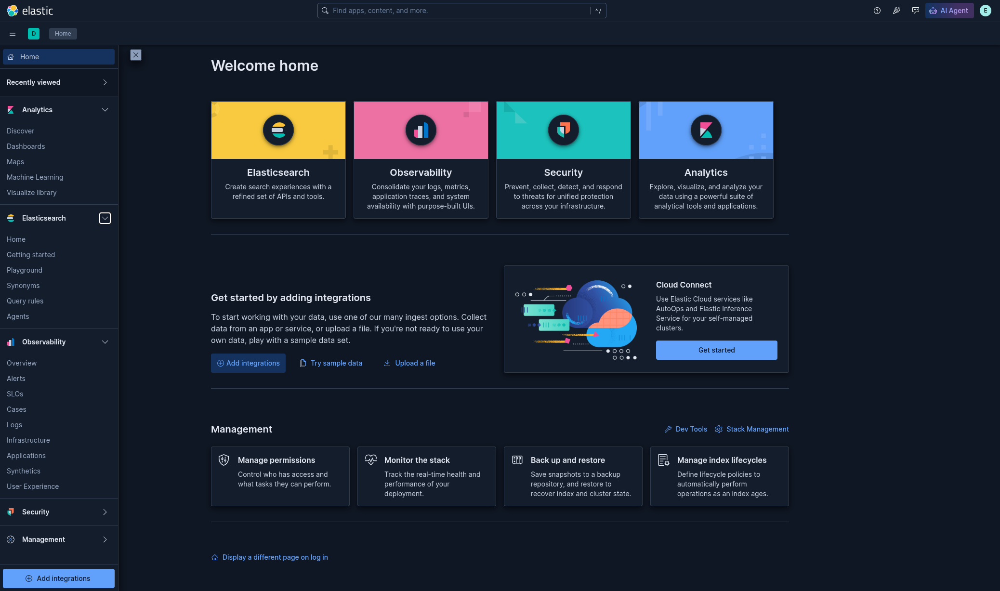</a><br><sub>Kibana — home</sub></td>
    <td align="center" width="33%"><a href="images/Screenshot_000916.png">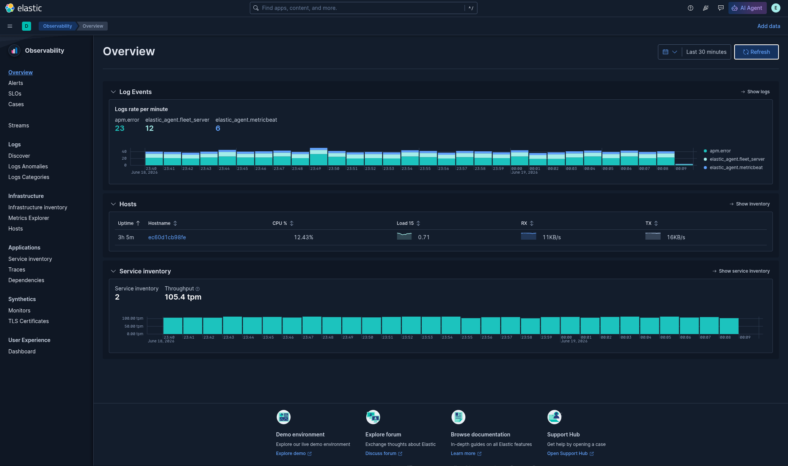</a><br><sub>Observability — visão geral</sub></td>
    <td align="center" width="33%"><a href="images/Screenshot_000745.png">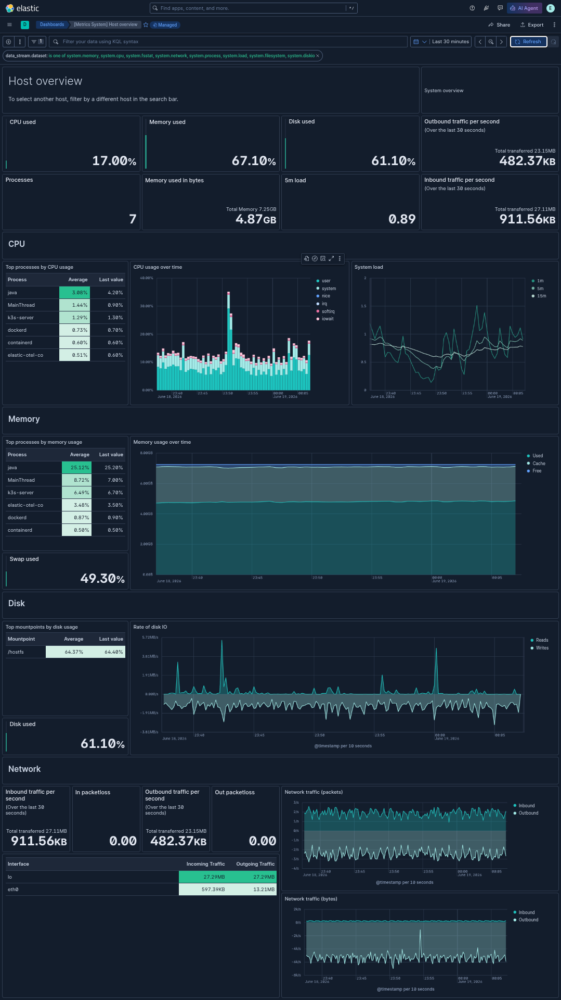</a><br><sub>Métricas de host (Elastic Agent)</sub></td>
  </tr>
  <tr>
    <td align="center"><a href="images/Screenshot_000852.png">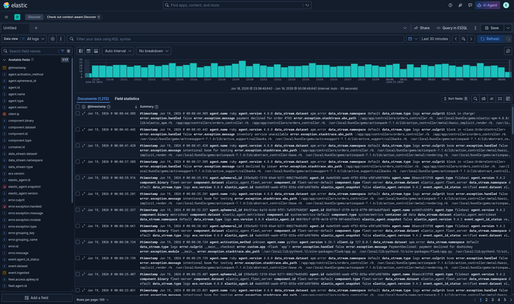</a><br><sub>Logs no Discover</sub></td>
    <td align="center"><a href="images/Screenshot_001054.png">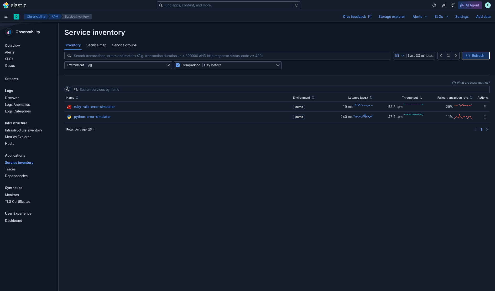</a><br><sub>APM — inventário de serviços</sub></td>
    <td align="center"><a href="images/Screenshot_001245.png">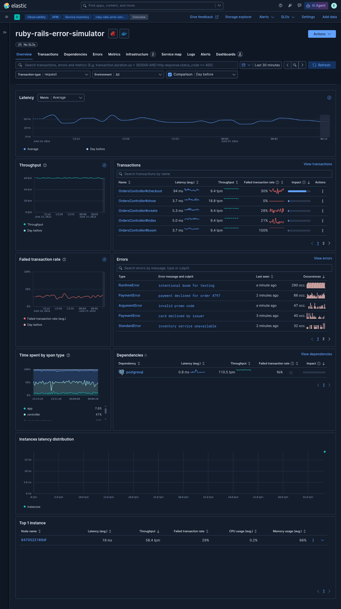</a><br><sub>APM — visão do serviço</sub></td>
  </tr>
  <tr>
    <td align="center"><a href="images/Screenshot_001332.png">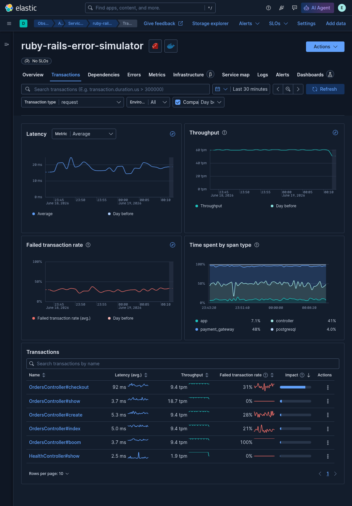</a><br><sub>APM — transações</sub></td>
    <td align="center"><a href="images/Screenshot_001534.png">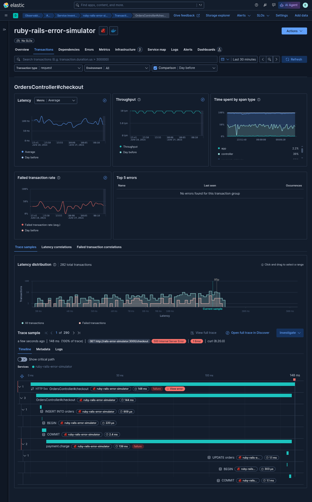</a><br><sub>APM — waterfall do trace (checkout)</sub></td>
    <td align="center"><a href="images/Screenshot_001359.png">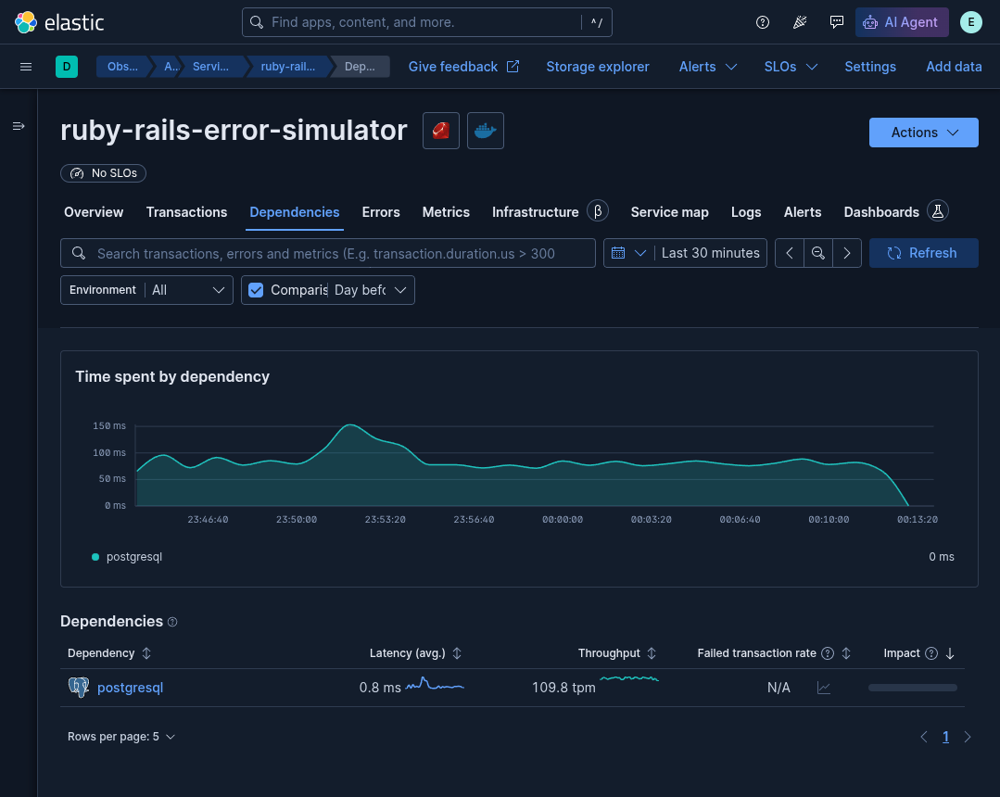</a><br><sub>APM — dependência PostgreSQL</sub></td>
  </tr>
  <tr>
    <td align="center"><a href="images/Screenshot_001414.png">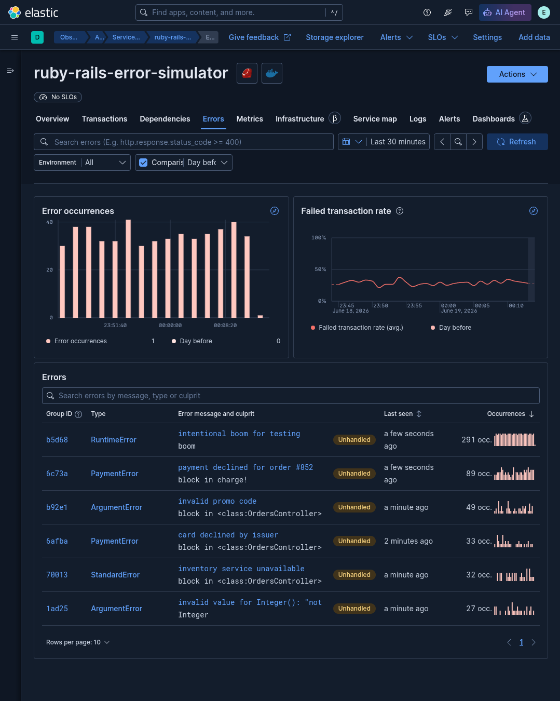</a><br><sub>APM — erros</sub></td>
    <td align="center"><a href="images/Screenshot_001438.png">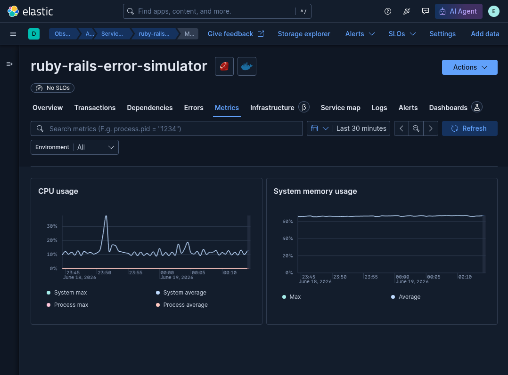</a><br><sub>APM — métricas do serviço</sub></td>
    <td align="center"><a href="images/Screenshot_001456.png">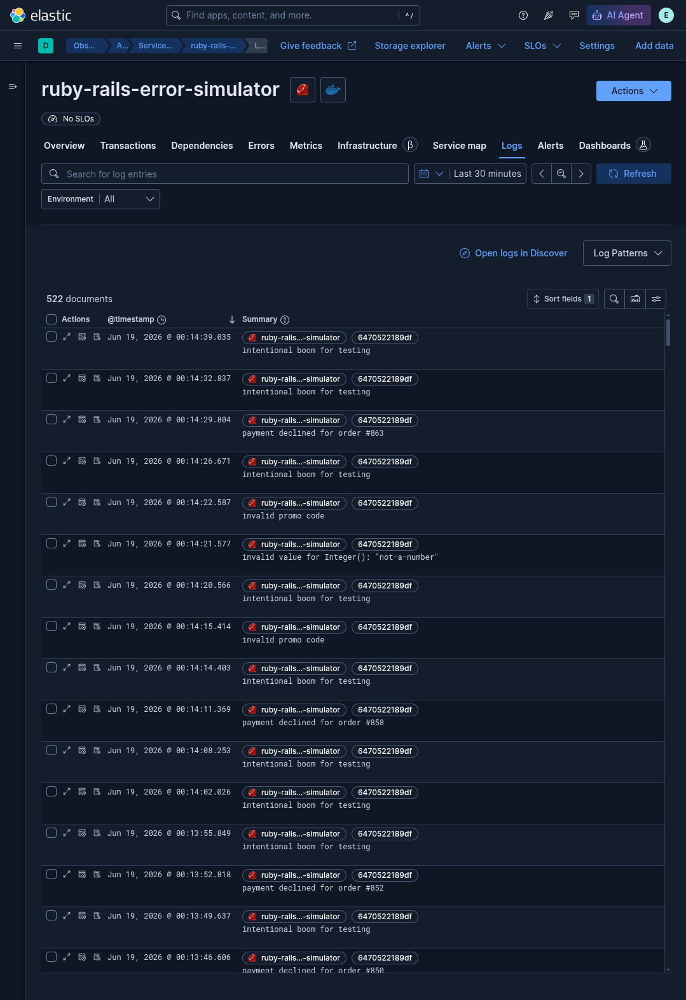</a><br><sub>APM — logs (correlacionados ao trace)</sub></td>
  </tr>
</table>
